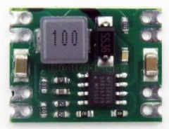

# cmk_livestatus_trafficlight
Trafficlight-style status display for CheckMK monitoring solution

# CheckMK Livestatus API
A description can be found here:
https://checkmk.com/cms_livestatus.html


# Platform
Linux board with i/o ports and LAN interface as platform. For me a wired LAN interface and a small form factor was important. 
This is the board I've used:

http://www.orangepi.org/orangepizero/

## OS
I've chosen Armbian as OS:
https://www.armbian.com/orange-pi-zero/
Downloaded and installed at a Sandisk 16GB uSD card as described there.

PRETTY_NAME="Armbian 20.08 Focal"
VERSION_ID="20.04"

### Preparation
update linux system and compile the GPIO library
```
root@orangepizero:~# 
armbian-config
apt update
apt upgrade
apt install python3-dev
mkdir /opt/trafficlight/
cd /opt/trafficlight/
git clone https://github.com/nvl1109/orangepi_zero_gpio.git
cd orangepi_zero_gpio/
python3 setup.py install
```
## Python program
Python Version at day of writing: Python 3.8.2

Copy the Python program "checkstatus.py" to the folder /opt/trafficlight.

/opt/trafficlight/checkstatus.py

Tasks of the program: Query Livestatus, calculate and set LED Status
Loop every [INTERVAL] seconds.

### Autostart
Put the following two lines in /etc/rc.local (before 'exit 0' !!!):
```
cd /opt/trafficlight/
./checkstatus.py
```

## Livestatus Queries
Three queries are necessary:
1) check if hosts, which relates to certain 'contact_groups' are unacknowledged (and not in scheduled maintanance) in status CRITICAL or WARN
2) check if services, which relates to hosts in certain 'contact_groups' are unacknowledged (and not in scheduled maintanance) in status CRITICAL
3) check if services, which relates to hosts in certain 'contact_groups' are unacknowledged (and not in scheduled maintanance) in status WARN

 1. st Query result is >0 = red Light on
 2. nd Query result is >0 = red Light on
 3. rd Query result is >0 = yellow Light on

If none of the queries returns a number greater 0, the green light is turned on and all other lights are turned off.

# Enable Livestatus
Enable Livestatus API access in CheckMK from network:

    [sitename-user]@checkmk server:~#
    omd stop;omd config set LIVESTATUS_TCP on;omd config set LIVESTATUS_TCP_ONLY_FROM '172.18.1.91';omd start

## GPIO

I usesed these pins as output for the LEDs:
 - RED LED: Port PG6
 - YELLOW LED: Port PG7
 - GREEN LED: Port PA7


https://github.com/nvl1109/orangepi_zero_gpio


## Power Supply

12V/0.5A feeding via Ethernet cable spare pins. This should be enough for 5 to 15 meters cable length depending on the cable quality. If you need to provide the power over a longer cable, you should use a higher voltage. But ATTENTION: two resistors must be removed from the OrangePi Zero board. They are 750 Ohms parallel to the PoE input and would overheat at such high voltages. See documentation. I've removed them anyway.
PoE pin of Orangepizero is wired to the input of the stepdown converter. The output of of the stepdown converter is wired to the 5V pin of the Orangepizero.

Power consumtion: The maximum power consumtion I saw at 12V side was 3.4 Watt during bootup when all LEDs (external, trafficlight) are on. After bootup a maximum of 1.6 Watts is drawn when all LEDs are on.
Also, I've added a Diode 1N4007 in series between 12V+ PoE and Vin of the buck converter as a protection in case of wrong polarity.
```
+12V PoE o----=>|----o +Vin buck converter +5V Vout o----------o +5V OrangePi Zero
             1N4007
             
  0V PoE o-----------o -Vin buck converter -5V Vout o----------o GND OrangePi Zero
```
Here I bought the buck converter (no affiliate link ;-)  ):
https://www.electrodragon.com/product/dc-dc-step-power-module-mp1584-fixed-output/


(use the fixed-output version. The ones with variable output are unreliable! Tried it with no luck)


## More Pictures
Here are some more pictures taken during the realisation of the project.


(The trafficlight was delivered with a tiny microcontroller and driver transistors at the LED board)


(I've removed the microcontroller and connected the OrangePi Zero through flexible cables to the solder pads where the output pins of the removed microcontroller where)


<!--stackedit_data:
eyJoaXN0b3J5IjpbNTIyMzc4NDc2LDE1ODIyODM3MTgsMTA0OD
E5OTk5M119
-->